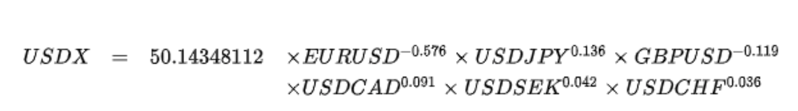

## 问
> 加息50个基点，基点是什么。有例子能说明吗？  
## 答
> &nbsp;&nbsp;&nbsp;&nbsp;基点通常是指的是贷款基础利率的调整点数，一个基点相当于0.01个百分点，即0.01%,加息50个几点，也就是将基准利率上调0.5%。  
&nbsp;&nbsp;&nbsp;&nbsp;美联储所谓的加息，并不是贷款利率，而是美联储联邦基金利率。是同业拆机利率，是其它金融机构向美联储借钱时的利率。加息后，意味着其它金融机构向美联储借钱的成本变高了。  
&nbsp;&nbsp;&nbsp;&nbsp;**由于美元是全球使用最多的货币，加息必定波及全球。**  
&nbsp;&nbsp;&nbsp;&nbsp;首先是股市，加息，流入股市的资金会减少，甚至还会导致流出股市，导致股市大跌。  
&nbsp;&nbsp;&nbsp;&nbsp;其次是外汇汇率，美元加息，那么美元对其他国家的货币会倾向于升值。美元加息等于向全世界收回美元，市场上美元的供给量变少，会增加对美元的需求，从而美元资产会升值。相应的。美元升值，其他人民币资产就会贬值。  
&nbsp;&nbsp;&nbsp;&nbsp;最后是包括贵金属在内的大宗商品的价格。美联储加息，对黄金也是利空，美联储加息，美元倾向于升值，以美元报价的黄金相对来说就会倾向于贬值，黄金的价格就会倾向于下跌。除了黄金外，其他比较有代表性的大宗商品，在美联储的加息之下，价格也是倾向于下跌。而大宗商品价格的波动，不仅会影响很多人的投资收益，同时也会影响广大老百姓的生活成本。

 

## 问
> 美元指数是什么（USDX）？他代表了什么？我们可以用它做什么？  
## 答
>&nbsp;&nbsp;&nbsp;&nbsp;是综合反映美元在国际外汇市场的汇率情况的指标，用来衡量美元对一揽子货币的汇率变化程度。它通过计算美元和对选定的一揽子货币的综合的变化率，来衡量美元的强弱程度，从而间接**反映美国的出口竞争能力和进口成本的变动情况**。  
&nbsp;&nbsp;&nbsp;&nbsp;USDX期货的计算原则是以全球各主要国家与美国之间的贸易结算量为基础，以加权的方式计算出美元的整体强弱程度，并以100点为强弱分界线。在1999年1月1日欧元推出后，这个期货合约的标的物进行了调整，从10个国家减少为6个国家（**欧元、日元、英镑、加拿大、瑞典克朗、瑞士法郎**）。欧元是权重最大的货币，其所占权重达到57.6%，因此，欧元的波动对USDX的强弱影响最大。  

  

> &nbsp;&nbsp;&nbsp;&nbsp;美元与黄金有很强的负相关性。由于金价以美元计价，美元的波动直接影响黄金的供求，导致金价波动。美元升值贬值意味着人们对原美元的信心，升值，说明人们看好美元。贬值，说明人们看空美元，需要持有黄金避险   
&nbsp;&nbsp;&nbsp;&nbsp;美元作为石油的定价货币，美元升值意味着石油更加便宜；美元贬值意味着石油越来越昂贵。

 

## 问
> 期货（futures），为什么叫期货，我买了期货大麦，会给我大麦吗？  
## 答
> &nbsp;&nbsp;&nbsp;&nbsp;与现货完全不同，现货是实实在在可以交易的货，期货是以某种大宗产品如棉花、大豆、石油等及金融资产如股票、债券等为标的物的**标准化可交易合约**。  
&nbsp;&nbsp;&nbsp;&nbsp;**期货合约标准化**指的是除价格外，期货合约的所有条款都是交易所规定好的，具有标准化的特点。  
&nbsp;&nbsp;&nbsp;&nbsp;期货交易的起源来自于现货的远期交易，因为商品价格不同月份存在着很大的差异，商品购入方为了降低自己的成本，商品卖出方为了保证自己的利润，就通过提前签订契约的方式，约定数量，价格。随着全球化不断发展，这种契约行为日益复杂化，需要有**中间人担保，**以便监督买卖双方按期交货和付款，于是便出现了期货交易所，渐渐地也形成了**标准化可交易合约**。  
&nbsp;&nbsp;&nbsp;&nbsp;在期货交易所交易的除了一些真正需要**套期保值的投资者（交割平仓）**，还有一些投机客，投机客买了期货大麦后，可以通过**临近交割月**卖出的形式进行平仓（**卖出平仓**）。  